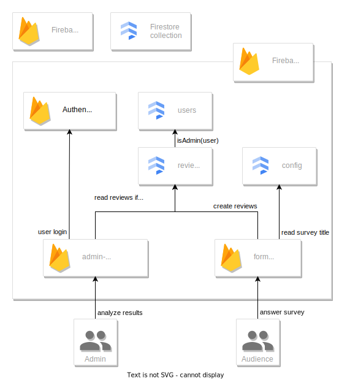
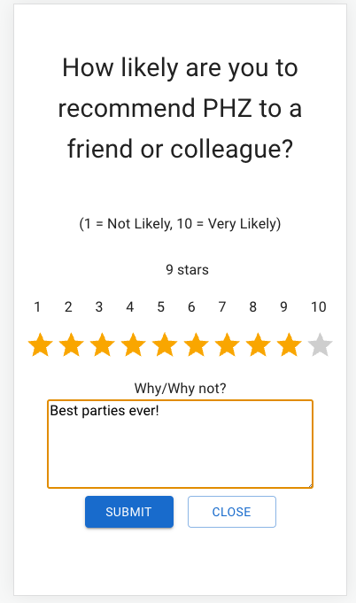

# Net Promoter Score form & dashboard

##### This project is forked from [BCHteam1's repositories](https://github.com/BCHteam1/)

## Super Quick Start

```
$ npm install       # install deps
$ npm start         # start form & dashboard dev env
$ npm run deploy    # build & deploy to Firebase
```

## 1. Project purpose

The purpose of this application is to measure the net promoter score of the customer.
The net promoter score is a research metric that takes the form of a single survey question asking respondents to rate the likelihood that they would recommend a company, product, or a service to a friend or colleague.
The typical question is:

> How likely are you to recommend us?

The scale for the answer ranges from 1 to 10.

The net promoter score can be interpreted and used as an indicator of customer loyalty and its value ranges from -100 to +100. A specific net promoter score can be used, for example, as a threshold for a bonus salary payment. For instance an employer can set a net promoter score of 30 as the threshold to pay a bonus to her employees.

The purpose of this application is to create a survey that can be embedded in any site.

## 2. Architecture

The project is divided into two applications:
- [`form`](./form/)
- [`admin-dashboard`](./admin-dashboard/)

The applications are hosted on [Firebase](https://firebase.google.com/). [Firestore](https://firebase.google.com/products/firestore) is used as a backend storage for the survey results, and also as the application configuration database.

To deploy the applications, you must:
- have an appropriate access to a Firebase project
- [configure the application](#4.1.) for the Firebase project

---

<br/>
_High level application architecture_

### 2.1. Main languages and technologies: Firebase & React

- Javascript/JSX
- React
- Material UI/css
- nivo for data visualization
- nodejs
- git/GitHub
- cypress for E2E testing
- [Firebase](https://firebase.google.com/)
  - [Firestore](https://firebase.google.com/products/firestore)

### 2.2. Information collected from users<a id='2.2.'></a>

The survey collects from the user only the likelyhood rate, that is a number for 1 to 10, and an optional comment. These informations are stored into the database with a generated timestamp.

No cookies are collected or stored so there is a No Cookie Policy.

When a user submits the survey, an item with an expiration date is set into the browser localStorage so that is not possible to submit again the form in the following 30 days.

If a user does not want to answer and clicks the CLOSE button, an item with an expiration date is set into the browser localStorage so that the form is not presented again in the following 7 days.

## 3. Development environment<a id='3.'></a>

### 3.1. Prerequisites, and what to do first

In order to set up a development environment for the applications, you need to have `npm` installed.

Install dependencies using `npm`:

```
$ npm install
```

It might be convenient to have [Firebase CLI](https://firebase.google.com/docs/cli) globally installed, but it can be used through `npx` too:

```
$ npm install -g firebase-tools  # globally install, or
$ npx firebase                   # use thru `npx`
```

### 3.2. Start the applications locally

Run the applications:

```
$ npm start
```

Form and dashboard should be automatically opened in the browser.
Form can be accessed at [`localhost:3000`](http://localhost:3000), admin dashboard at [`localhost:3001`](http://localhost:3001) 

**N.B.:** *Despite running locally, applications are currently using the project's Firestore storage.*

**N.B.:** *Local storage must be cleared (e.g. using developer console) between the form submissions, for more details, see [section 2.2.](#2.2.)*

### 3.3. Run tests

#### TODO

`license-checker` will automatically check that all packages and dependencies pass the licence check.
The allowed licences can be found in `<app_dir>/config/license-checker-config.js`
The last two licences, `0BSD` and `CC0-1.0` still need confirmation from the legal deparment. They were added to the customer provided list to pass the licence check.

## 4. Production environment & configuration<a id='4.'></a>

### 4.1. Deployment<a id='4.1.'></a>

The applications are deployed to Firebase, check the configuration files and Firebase project settings for details:

- [`.firebaserc`](./.firebaserc)
- [`firebase.json`](./firebase.json)
- [`firestore.rules`](./firestore.rules)
- [`config/index.js`](./config/index.js)

The applications can be built and deployed to Firebase with a convenience script:

```
$ npm run deploy
```

#### 4.1.1. Deployment from the absolute scratch

0. Make sure your [development environment](#3.) is working. You must be able to successfully `npm run build`.
1. [Log the CLI into Firebase](https://firebase.google.com/docs/cli#sign-in-test-cli): `$ npx firebase login`
2. [Create a new Firebase _project_](https://firebase.google.com/docs/web/setup#create-project). Google Analytics is not used by the applications and can be disabled. After creating the project, configure it as desired.
    - from CLI: `$ npx firebase projects:create -n <display name> <project id>`
3. Add the project as a default for Firebase CLI: `$ npx firebase use --add`
4. [Register a new Firebase _web app_](https://firebase.google.com/docs/web/setup#register-app).
    - from CLI: `$ npx firebase apps:create web <app name>`
5. Print and copy the _project configuration_ object  to [`config/index.js`](config/index.js) to configure the applications for Firebase.
    - from CLI: `$ npx firebase apps:sdkconfig WEB <app id>`
    - [`firebaseConfig` object](https://firebase.google.com/docs/web/setup#add-sdks-initialize) from the project settings in the web console
6. Create Firebase Hosting _sites_ for the form and the dashboard:<br/>`$ npx firebase hosting:sites:create <site id>`
    - Project might have already a site created you might want to use. List all sites with:<br/>`$ npx firebase hosting:sites:list`
7. [Add _deploy targets_](https://firebase.google.com/docs/hosting/multisites#set_up_deploy_targets) to Firebase CLI:
    ```
    $ npx firebase target:apply hosting admin-dashboard <dashboard site id>
    $ npx firebase target:apply hosting form <form site id>
    ```
    Additionally, clean up [`.firebaserc`](./.firebaserc). Remove references to other Firebase projects from the `"targets"` object.
8. [Enable the Email/Password Authentication provider](https://firebase.google.com/docs/auth/web/firebaseui#email_address_and_password) for your project.
9. [Provision Cloud Firestore](https://firebase.google.com/docs/firestore/quickstart#create) for your project.
10. [Add a _collection_](https://firebase.google.com/docs/firestore/using-console#add_data) `config` and a _document_ `form` into it. Add a _field_ `surveyTitle` of type string to the document to set the title of the survey form.
11. Add a collection `users` for user account to role mapping. Adding the user roles is explained in [section 4.2.0.](#4.2.0.)
12. Deploy the applications: `$ npm run deploy`

### 4.2. Access control

Access control is implemented with Firestore security rules, see [`firestore.rules`](./firestore.rules).

Since the form is designed to allow anonymous submissions, unauthenticated writes to the collection `/reviews/` are allowed.

Survey results should be read only by privileged users, thus the collection `/reviews/` can be read only if currently authenticated user has the role `admin`. Role to user account mappings are defined in the collection `/users/`.

#### 4.2.0. Add a new admin user<a id='4.2.0.'></a>

Create a new email/password user to Firebase Auth at the web console.

Then, create a new document into the collection `/users/` through the Firebase web console.
Document ID should be user's email and it should have a field `role` with a value of `admin`.

### 4.3. Form title

Form title is user-configurable and is stored in a field `surveyTitle` in the Firestore document `/config/form`.

### 4.4. Form embedding

- Place the below HTML elements anywhere on your page

```html
<!-- EMBEDDABLE PROMOTER SCORE SURVEY -->
<div id="psForm"></div>
<script
  src="<URL TO DEPLOYMENT /static/js/main.*.js>"
  type="text/javascript"
></script>
<!-- EMBEDDABLE PROMOTER SCORE SURVEY -->
```

## 5. Code style

Cypress requires the following:

in `package.json`

```json
"eslintConfig": {
  "extends": [
    "react-app",
    "react-app/jest"
  ]
},
```

## 6. Screenshots




