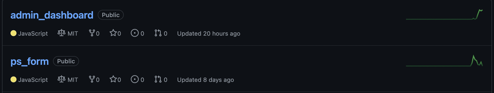

# Promoter Score Dashboard Documentation V1.0.0

## 1. Project purpose

The purpose of this application is to measure the promoter score of the customer.
The promoter score is a research metric that takes the form of a single survey question asking respondents to rate the likelihood that they would recommend a company, product, or a service to a friend or colleague.
The typical question is:

`How likely are you to recommend us?`

The scale for the answer ranges from 1 to 10 or from 0 to 10.

The promoter score can be interpreted and used as an indicator of customer loyalty and its value ranges from -100 to +100. A specific promoter score can be used, for example, as a treshold for a bonus salary payment. For instance an employer can set a promoter score of 30 as the threshold to pay a bonus to her employees.

The purpose of this application is to create a dashboard that can analyse data and calculate a promoter score.

## 2. Architecture

The project is divided into two repositories:


The database is hosted on Firebase Firestore Database.

### 2.1 Main languages and technologies:

- Javascript/JSX
- React
- nivo for data visualization
- git/GitHub
- jest

## 3. Development environment

### 3.1. Prerequisites, and what to do first

In order to set up a development environment you need to have installed:

```json
 "dependencies": {
    "@nivo/bar": "^0.79.1",
    "@nivo/core": "^0.79.0",
    "@nivo/line": "^0.79.1",
    "@nivo/pie": "^0.79.1",
    "@react-icons/all-files": "^4.1.0",
    "@testing-library/jest-dom": "^5.16.4",
    "@testing-library/react": "^13.0.1",
    "@testing-library/user-event": "^13.5.0",
    "classnames": "^2.3.1",
    "firebase": "^9.7.0",
    "react": "^18.0.0",
    "react-dom": "^18.0.0",
    "react-icons": "^4.3.1",
    "react-router-dom": "^6.3.0",
    "react-scripts": "5.0.1",
    "react-syntax-highlighter": "^15.5.0",
  },
"devDependencies": {
  "license-checker": "^25.0.1",
  "license-to-fail": "^4.0.0"
}
```

To run dashboard locally:

```sh
npm start
```

To open deployed version of the dashboard:

https://dynamic-smakager-25c390.netlify.app/

`licence-checker` will automatically check that all packages and dependencies pass the licence check. The allowed licences are:

```json
	allowedLicenses: [
		"MIT",
		"Apache-2.0",
		"ISC",
		"Apache",
		"WTF",
		"Public Domain",
		"MPL",
		"CC-BY-3.0",
		"CC-BY-4.0",
		"BSD-3-Clause",
		"BSD-2-Clause",
		"X11",
		"WTFPL",
		"CDDL",
		"LGPL",
		"Apache 2.0",
		"MIT/X11",
		"AFL",
		"(MIT AND CC-BY-3.0)",
		"Unlicense",
		"OFL-1.1 AND MIT",
		"0BSD",
		"CC0-1.0",
	]
```

The last two licences, `0BSD` and `CC0-1.0` still need confirmation from the legal deparment. They were added to the customer provided list to pass the licence check.

### 3.2. IDE setup

No particular setup needed.

### 3.3. Version control: git

- the git workflow used in this project is merge
- we initially agreed on squashing commits to have a clean and readble history but we dropped this practice as the project progressed since we would commit fairly rarely already, once a day or even less often
- no specific commit messages requirements
- naming conventions for branches:
  Create and switch to new branch:

```sh
git checkout -b feature/T1-1_featureName
```

where `T1-1`is the issue/task id in Jira, followed by underscore and then the feature name which can is the Jira issue/task title.

When a feature/issue is ready, push to feature branch and make a pull request. Another team member need to merge into main. Possible conflicts may be resolved together.

## 4. Production environment

### 4.1. Access

- The URL where the application can be found: https://dynamic-smakager-25c390.netlify.app/

#### 4.1.1. Usage

- Main dashboard page shows all the data and how it has been analyzed.
- Embed page has HTML code which can be used to add our survey to any website.

##### 4.1.2 Pie chart

- First user can change time period for the data analysis, 1 month, 3 months, 6 months and 1 year. This affects all the parts of dashhboard.

- In the middle of the pie chart is promoter score calculated for the chosen period of time. Around it are green, yellow and orange parts, which show amount of Promoters, Passives and Detractors.

- By clicking on colorful parts of the pie chart, user will get only relevant comments. For example, clicking on Promoters, user will only see Promoters' comments. If user wants to see all the comments again, he/she should click on responses box in the top right corner of pie chart.

##### 4.1.3 Comments section

- On the right side of the pie chart is the comment section. It is affected by the pie chart as explained earlier.

- Next to the header user can see overall amount of comments. All comments are sorted in a way that user can see newest comments first.

- Each comment part has a score, a star, a comment and a date. Based on Promoters, Passives and Detractors each comment has different background and star color which coresponds with the score.

##### 4.1.4 Trend

- Trend shows the promoter score changes for every day of the chosen period of time.

- Some labels are skipped based on time selection.

- On the left side is the score level from -100 to 100 and on the botton are the dates. Bonus limit is 30, by reaching it employee could get some bonuses for their work.

- Blue line shows the promoter score and black thin line alignes it with the date.

##### 4.1.5 Response Volume

- Response volume shows the amount of Promoters, Passives and Detractors per day.

## 5. Continuous integration

Manually deployed on Netlify using one of our team member's personal account.

## 6. More useful information, Tips and Tricks

Firebase Firestore Database configuration in file `firebase-config.js` need to be replaced with user's own project credentials:

```js
const firebaseConfig = {
	apiKey: "your-api-key",
	authDomain: "your-domain",
	projectId: "your-project-id",
	storageBucket: "your-bucket",
	messagingSenderId: "your-id",
	appId: "your-app-id",
};
```

For that a new project should be created on user's Firebase account.


Open API with a limit of 20 reviews per page: https://firestore.googleapis.com/v1/projects/promoter-score/databases/(default)/documents/reviews To see next page: https://firestore.googleapis.com/v1/projects/promoter-score/databases/(default)/documents/reviews?pageToken={nextPageToken}

## 7. Screenshots


